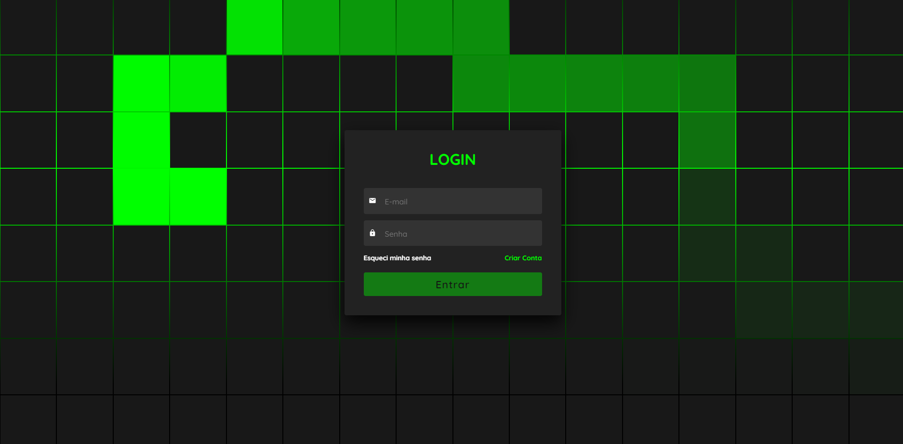

# Login Form

## 📃Descrição

Este projeto é uma tela de login, desenvolvido com React e Styled Components. Seu objetivo principal é implementar uma etapa de autenticação e validação dentro do React com React Hook Form e yup.

## 🚀 Tecnologias Utilizadas

- **React**: Biblioteca JavaScript para construção de interfaces de usuário.
- **HTML, CSS:** Linguagens padrão para estrutura e estilização de páginas web.
- **JavaScript:** Linguagem de programação para lógica e interação com o DOM.
- **Styled Components**: Biblioteca para criação de componentes React com estilos personalizados e reusáveis.
- **JSON Server**: Simula um backend RESTful leve para armazenar os dados da aplicação durante o desenvolvimento, facilitando a criação de requisições HTTP e o gerenciamento de estados.

## 🚧 Pré-requisitos

- **Node.js e npm (ou yarn)**: Certifique-se de ter o Node.js e o gerenciador de pacotes npm (ou yarn) instalados em seu sistema.
- **Um editor de código:** Visual Studio Code, Sublime Text, Atom, etc.

## 📥 Instalação

1. Clone o repositório: `git clone https://github.com/Nickcarv18/login-form.git`
2. Acesse a pasta do projeto: `cd login-form`
3. Instale as dependências: `npm install`

## 💻 Execução

1. Inicie o servidor de desenvolvimento: `yarn start`

    - A aplicação será aberta em seu navegador padrão, geralmente em <http://localhost:3000>.

1. Inicie JSON Server CLI: `yarn api`

    - O JSON Server CLI será iniciada em <http://localhost:8001>.

## 🔧 Estrutura do Código

    dio-clone/
    ├── node_modules/
    ├── public/
    │   ├── favicon.ico
    │   └── index.html
    ├── src/
    │   ├── components/
    │   │   ├── Button/
    │   │   ├── Input/
    │   ├── pages/
    │   │   └── Login/
    │   ├── services/
    │   │   └── api.ts
    │   ├── styles/
    │   │   └── global.ts
    │   ├── index.ts
    │   ├── .gitignore
    │   ├── db.json
    │   ├── package-lock.json
    │   ├── package.json
    │   ├── README.md
    │   └── yarn.lock

- **components**: Contém componentes reutilizáveis como `Button`, `Input`, etc.
- **db.json**: Arquivo de configuração do JSON Server, onde são armazenados os dados simulados da aplicação.
- **services/api.js**: Arquivo de configuração da api com axios.
- **styles**: Arquivo de estilo global.
- **assets**: Contém arquivos de imagem e outros recursos estáticos.
